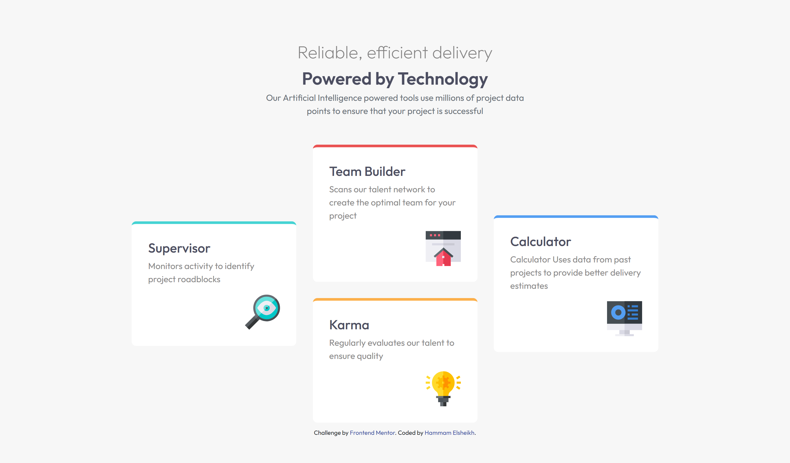

# Frontend Mentor - Four card feature section solution

This is a solution to the [Four card feature section challenge on Frontend Mentor](https://www.frontendmentor.io/challenges/four-card-feature-section-weK1eFYK). Frontend Mentor challenges help you improve your coding skills by building realistic projects.

## Table of contents

- [Overview](#overview)
  - [The challenge](#the-challenge)
  - [Screenshot](#screenshot)
  - [Links](#links)
  - [Built with](#built-with)
  - [What I learned](#what-i-learned)
- [Author](#author)

## Overview

### The challenge

Users should be able to:

- View the optimal layout for the site depending on their device's screen size

### Screenshot

### Links

- [Live Site URL]https://himo-dev-four-card-feature-section.netlify.app/

### Built with

- Semantic HTML5 markup
- scss
- Flexbox
- Mobile-first workflow

### What I learned

practiced flexbox and faced some challenges like:
flex items that has the same grow rate can differ in width if any of them has padding
and others don't have.

fix: use .column for each column you want and apply flex-grow onto,
add the padding inside the item .card for example.

## Author

- Frontend Mentor - [@hammam-elsheikh](https://www.frontendmentor.io/profile/yourusername)
- Twitter - [@HammamElsheikh](https://www.x.com/HammamElsheikh)
